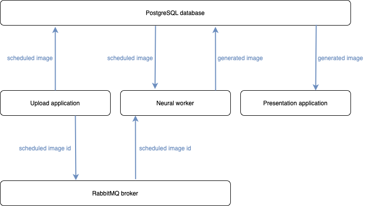
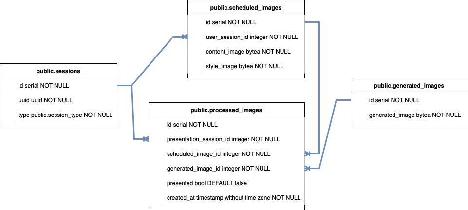

# Interactive Neural Style Transfer

Interactive Neural Style Transfer application created for the [Noc vědců](https://www.nocvedcu.cz) event is a web
application designed to interactively present the fast neural style transfer algorithm to the audience.

Neural style transfer algorithm is a method to blend two images into a new one. The algorithm extracts visual structure
from a content image and style from a style image. The visual structure (content) and style are blended together to
create a new image.

Fast neural style transfer algorithm is a modification of the neural style transfer algorithm to perform nearly in
real-time.

## Table of contents

1. [Structure and description](#structure-and-description)
    1. [Upload application](#upload-application)
        1. [Feature descriptions](#upload-application-feature-descriptions)
    2. [Neural worker](#neural-worker)
        1. [Feature descriptions](#neural-worker-feature-descriptions)
    3. [Presentation application](#presentation-application)
        1. [Feature descriptions](#presentation-application-feature-descriptions)
    4. [PostgreSQL Database Structure](#postgresql-database-structure)
        1. [Sessions table](#sessions-table)
        2. [Scheduled images table](#scheduled-images-table)
        3. [Generated images table](#generated-images-table)
        4. [Processed images table](#processed-images-table)
3. [Installation and execution](#installation-and-execution)
    1. [Pre-installation requirements](#pre-installation-requirements)
        1. [Docker](#docker)
        2. [Ngrok](#ngrok)
        3. [Git](#git)
        4. [Make](#make)
    2. [Clone the repozitory and enter the project](#clone-the-repozitory-and-enter-the-project)
    3. [Get a public URL](#get-a-public-url)
    4. [Create a QR code](#create-a-qr-code)
    5. [Run the Interactive Neural Style Transfer application](#run-the-interactive-neural-style-transfer-application)
    6. [Open the LIVE view in a browser](#open-the-live-view-in-a-browser)
    7. [Scan the QR code in the Presentation application](#scan-the-qr-code-in-the-presentation-application)
4. [Maintenance](#maintenance)
5. [FAQ](#faq)
    1. [What is Interactive Neural Style Transfer application?](#what-is-interactive-neural-style-transfer-application)
    2. [What is Neural Style Transfer algorithm?](#what-is-neural-style-transfer-algorithm)
    3. [What is Fast Neural Style Transfer algorithm?](#what-is-fast-neural-style-transfer-algorithm)
    4. [Do I need a paid tier of ngrok to run the Interactive Neural Style Transfer application?](#do-i-need-a-paid-tier-of-ngrok-to-run-the-interactive-neural-style-transfer-application)
    5. [Do I need to use ngrok to publish the Upload application?](#do-i-need-to-use-ngrok-to-publish-the-upload-application)
    6. [Is it safe to use the Upload application?](#is-it-safe-to-use-the-upload-application)
    7. [How many users can connect to the Interactive Neural Style Transfer application through the Upload application?](#how-many-users-can-connect-to-the-interactive-neural-style-transfer-application-through-the-upload-application)
    8. [How many Presentation application sessions can be opened at once on different browser windows?](#how-many-presentation-application-sessions-can-be-opened-at-once-in-different-browser-windows)
    9. [How can I change style images?](#how-can-i-change-style-images)
    10. [Page is not accessible after scanning QR code from the Presentation application. What is the problem?](#page-is-not-accessible-after-scanning-qr-code-from-the-presentation-application-what-is-the-problem)
    11. [Presentation or Upload application is inaccessible. Why?](#presentation-or-upload-application-is-inaccessible-why)
    12. [There is no QR code in the Presentation application, but there is a red error message. What shall I do?](#there-is-no-qr-code-in-the-presentation-application-what-shall-i-do)
    13. [There a red error message in the Presentation application. What shall I do?](#there-a-red-error-message-in-the-presentation-application-what-shall-i-do)

## Structure and description

The Interactive Neural Style Transfer application is made of 3 separate applications:

- Upload application,
- Neural worker,
- and Presentation application.

Data between these applications is transferred via RabbitMQ messaging broker and PostgreSQL database.



### Upload application

Upload application is a web application based on [Streamlit](https://streamlit.io). Its primary purpose is to provide a
mobile friendly UI to upload content images, select style images and download stylized images. The Upload application is
published on a public IP via ngrok.

#### Upload application feature descriptions

- When a new user opens the Upload application in a browser, a unique session UUID is created and stored into the
  PostgreSQL database, so the user is later able to download their own stylized images.

- When a user uploads a content image, selects a style image and confirms processing, the Upload application stores the
  content and style images into `scheduled_images` table in the PostgreSQL database and sends the record's `id` via
  RabbitMQ channel to the Neural worker application for stylization.

- After the submitted images are processed, the Upload application notifies the user and offers a way to download the
  stylized image.

### Neural worker

Neural worker is a backend application wrapping fast neural style transfer model. Its primary purpose is to stylize
submitted images by users via the Upload application.

#### Neural worker feature descriptions

- Neural worker transforms content and style images into stylized images scheduled in `scheduled_images` table in
  PostgreSQL database. Neural worker identifies new scheduled images by the `id` received through RabbitMQ channel.

- After image stylization, the Neural worker stores the generated image into `generated_images` table in the PostgreSQL
  database and creates records in `processed_images` for all the running Presentation application sessions. Presentation
  application sessions are in table `sessions` with attribute `type='presentation'`.

### Presentation application

Presentation application is a web application based on [Streamlit](https://streamlit.io). Its primary purpose is to
provide a UI to display stylized images submitted by users on a presentation screen.

#### Presentation application feature descriptions

- When a new session of the Presentation application is opened in a browser window, a unique session UUID is created and
  stored into the PostgreSQL database.

- Every session of the Presentation application automatically scans the `processed_images` table in the PostgreSQL
  database, so all Presentation application sessions update the displayed images when a new image is stylized.

- When there are many images being stylized at once, there is guaranteed that each stylized image stays displayed in the
  Presentation application at least 5 seconds.

- The Presentation application scans the `qr-code.png` file in the projects root folder.
It automatically updates the web view whenever there is a new version of the `qr-code.png` file.
If the file is removed completely, the Presentation application keeps the last valid version. 


### PostgreSQL database structure



#### Sessions table

Sessions table stores `user` and `presentation` session.

- A `user` session is created when a new device opens the Upload application.
- A `presentation` session is created when a new device opens the Presentation application.

#### Scheduled images table

Scheduled images table stores content and style images scheduled for stylization.

#### Generated images table

Generated images table stores stylized images.

#### Processed images table

Processed images table stores a list of stylized images assigned to each Presentation application session. This table
ensures, that all active Presentation application sessions can update its displayed images.

## Installation and execution

Run this installation on a PC or laptop connected to internet connection and to a projector (or large monitor).

### Pre-installation requirements

- PC or laptop connected to a projector (or large monitor)
- Internet connection
- [Docker](https://www.docker.com)
- [Ngrok](https://ngrok.com/download)
- [Git](https://git-scm.com)
- [Make](https://www.gnu.org/software/make/)

Optional:

- Wi-Fi connection for attendants

#### Docker

- [Install](https://www.docker.com/get-started/) and [run docker](https://docs.docker.com/desktop/).

> NOTE: Ensure installed and running docker by running `docker info` command in your terminal. The command should not return an error.

#### Ngrok

- [Install ngrok](https://ngrok.com/download), [log in](https://dashboard.ngrok.com/login)
  and [connect your account](https://dashboard.ngrok.com/get-started/setup).

> NOTE: Ensure installed ngrok by running `which ngrok` command in your terminal. The command should not return an error.

#### Git

- [Install git](https://git-scm.com/book/en/v2/Getting-Started-Installing-Git).

> NOTE: Ensure installed git by running `which git` command in your terminal. The command should not return an error.

#### Make

- [Install make](http://gnuwin32.sourceforge.net/install.html)

> NOTE: Ensure installed make by running `which make` command in your terminal. The command should not return an error.

### Clone the repozitory and enter the project

```bash
git clone https://github.com/domcermak/neural_style_transfer.git && cd neural_style_transfer
```

### Get a public URL

```bash
make serve
```

### Create a QR code

- Open [https://www.qrcode-monkey.com](https://www.qrcode-monkey.com) and generate a new QR code from the public URL
  generated by the previous step starting with `https://`.
- Copy the `qr-code.png` file to the root folder of the Interactive Neural Style Transfer application.

### Run the Interactive Neural Style Transfer application

Following command starts the dockerized Interactive Neural Style Transfer application. This process takes up to several
minutes.

```bash
make run
```

### Open the LIVE view in a browser

Following command opens the Presentation application in the default browser. Move the browser window to the connected
projector (or monitor) to effectively present the Interactive Neural Style Transfer application.

```bash
make live
```

### Scan the QR code in the Presentation application

By scanning the QR code displayed in the Presentation application running in
the [previously opened](#open-the-live-view-in-a-browser) browser window, users can submit their images to be stylized.

## Maintenance

Free tier ngrok session has 2 hours expiration period. This means that it stops publishing the port with the Upload
application after 2 hours and users are no longer be able to access the application. 

To fix this:
1. Stop (ctrl + c) ngrok and [start it](#get-a-public-url) again.
2. [Create a new QR](#create-a-qr-code) code matching the new ngrok URL.
3. Replace the old `qr-code.png` file in the project's root folder with the new version of `qr-code.png` file.

The Presentation application automatically checks the `qr-code.png`
and updates it in the web view when there is a new version of the file.

## FAQ

### What is Interactive Neural Style Transfer application?

Interactive Neural Style Transfer application created for the [Noc vědců 2021](https://www.nocvedcu.cz) event is a web
application designed to interactively present the fast neural style transfer algorithm to the audience.

### What is Neural Style Transfer algorithm?

Neural style transfer algorithm is a method to blend two images into a new one. The algorithm extracts visual structure
from a content image and style from a style image. This visual structure (content) and style are then blended together
to create a new image.

### What is Fast Neural Style Transfer algorithm?

Fast neural style transfer algorithm is a modification of the neural style transfer algorithm, to perform nearly in
real-time.

Neural style transfer algorithm is a method to blend two images into a new one. The algorithm extracts visual structure
from a content image and style from a style image. This visual structure (content) and style are then blended together
to create a new image.

### Do I need a paid tier of ngrok to run the Interactive Neural Style Transfer application?

It depends on your audience. [Free tier](https://ngrok.com/pricing) of ngrok allows up to 40 unique connections per
minute. You might want to consider paid version of ngrok if you plan to have more than 40 unique users per minute.

### Do I need to use ngrok to publish the Upload application?

No. Ngrok is a default solution here to publish an application running on localhost to the world. You can use any other
service serving the same purpose.

### Is it safe to use the Upload application?

Yes. There are no user sensitive information being stored. Also, if set up correctly, the Upload application is running
over HTTPS.

### How many users can connect to the Interactive Neural Style Transfer application through the Upload application?

This depends a lot on the subscription tier of ngrok.
[Free tier](https://ngrok.com/pricing) of ngrok allows up to 40 unique connections per minute.

### How many Presentation application sessions can be opened at once in different browser windows?

As many as you wish. Each Presentation application session has its own unique UUID which ensures that all sessions get
updates about newly stylized images.

### How can I change style images?

Style images are built-in and available in `./data/style/` folder. You can extend or replace the list of images.

Style images constraints:

- Only JPG and JPEG images are supported.
- At least one style image must be present.

> NOTE: It is recommended to use paintings or drawings as a style images.
> Other kinds of images could result in unpleasant stylization.

### Page is not accessible after scanning QR code from the Presentation application. What is the problem?

The Presentation application runs only on localhost, but the Upload application is published via ngrok on a public IP.
There might be 2 problems:

- Either ngrok is not running and therefore the Upload application is not published,
- or the QR code does not represent the current URL given by ngrok.

To fix the problem:
1. Restart ngrok.
2. Create a new QR code from the public URL given by ngrok.
3. Copy the new `qr-code.png` file to the root folder of the project.

The Presentation application automatically checks the `qr-code.png`
and updates it in the web view when there is a new version of the file.

### Presentation or Upload application is inaccessible. Why?

The Presentation application runs on `http://localhost:8051` and the Upload application on `http://localhost:8080`
. There might be a port collision. Check the logs of the running containers. If the docker container logs mention port
collision, identify and quit the colliding application.

### There is no QR code in the Presentation application. What shall I do?
If you see a red error message `QR kód nebyl nalezen` in the sidebar of the Presentation application, 
it means that the application cannot find a `qr-code.png` file in the root folder of the project.

1. Make sure the `qr-code.png` file is in the root folder of the project.
2. Make sure, there is not a typo in the `qr-code.png` filename.

### There a red error message in the Presentation application. What shall I do?
If you see a red error message `QR kód nebyl nalezen` in the sidebar of the Presentation application, 
it means that the application cannot find a `qr-code.png` file in the root folder of the project.

1. Make sure the `qr-code.png` file is in the root folder of the project.
2. Make sure, there is not a typo in the `qr-code.png` filename.

