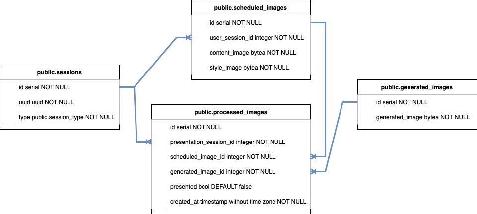

# Interactive Neural Style Transfer

Interactive Neural Style Transfer application created for the [Noc vědců 2021](https://www.nocvedcu.cz) event is a web
application designed to interactively present the fast neural style transfer algorithm to the audience.

Neural style transfer algorithm is a method to blend two images into a new one. The algorithm extracts visual structure
from a content image and style from a style image. The visual structure (content) and style are blended together to
create a new image.

Fast neural style transfer algorithm is a modification of the neural style transfer algorithm to perform nearly in
real-time.

## Structure and description

The Interactive Neural Style Transfer application is made of 3 separate applications:

- Upload application,
- Neural worker,
- and Presentation application.

Data between these applications is transferred via RabbitMQ messaging broker and PostgreSQL database.

### Upload application

Upload application is a web application based on [Streamlit](https://streamlit.io). Its primary purpose is to provide a
mobile friendly UI to upload content images, select style images and download stylized images. The Upload application is
published on a public IP via ngrok.

#### Feature descriptions

- When a new user opens the Upload application in a browser, a unique session UUID is created and stored into the
  PostgreSQL database, so the user is later able to download their own styled images.

- When a user uploads a content image, selects a style image and confirms processing, the Upload application stores the
  content and style images into `scheduled_images` table in the PostgreSQL database and sends the record's `id` to the
  Neural worker application for processing via RabbitMQ channel.

- After the submitted images are processed, the Upload application notifies the user and offers a way to download the
  processed image.

### Neural worker

Neural worker is a backend application wrapping fast neural style transfer model. Its primary purpose is to stylize
submitted images by users via the Upload application in real time.

#### Feature descriptions

- Neural worker transforms content and style images into stylized images scheduled in `scheduled_images` table in
  PostgreSQL database. Neural worker identifies new scheduled images by the `id` received from RabbitMQ channel.

- After image stylization, the Neural worker stores the generated image into `geneated_images` table in the PostgreSQL
  database and creates records in `processed_images` for all the running Presentation application sessions. Presentation
  application sessions are in table `sessions` with attribute `type='presentation'`.

### Presentation application

Presentation application is a web application based on [Streamlit](https://streamlit.io). Its primary purpose is to
provide a UI to display stylized images submitted by users in a presentation room.

#### Feature descriptions

- When a new instance of the Presentation application is opened in a browser window, a unique session UUID is created
  and stored into the PostgreSQL database. When an image for stylization is submitted and stylized, the stylized image
  is registered to the all existing presentation session UUIDs.

- Every instance of the Presentation application automatically scans in the `processed_images` table in the PostgreSQL
  database, so all Presentation application instances update the displayed images when a new image is stylized.

- When there are many images being stylized at once, there is guaranteed that each stylized image stays displayed in the
  Presentation application at least 5 seconds.

### PostgreSQL database structure



## Pre-installation requirements

- PC or laptop connected to a projector (or large monitor)
- Internet connection
- [Docker](https://www.docker.com)
- [Ngrok](https://ngrok.com/download)
- [Git](https://git-scm.com)

Optional:

- Wi-Fi connection for attendants

## Installation and execution

Run this installation on a PC or laptop connected to internet connection and to a projector (or large monitor).

### Ensure pre-installation requirements are fulfilled

- [Install](https://www.docker.com/get-started/) and [run docker](https://docs.docker.com/desktop/).

> NOTE: Ensure installed and running docker by running `docker info` command in your terminal. The command should not return an error.

- [Install ngrok](https://ngrok.com/download), [log in](https://dashboard.ngrok.com/login)
  and [connect your account](https://dashboard.ngrok.com/get-started/setup).

> NOTE: Ensure installed ngrok by running `which ngrok` command in your terminal. The command should not return an error.

- [Install git](https://git-scm.com/book/en/v2/Getting-Started-Installing-Git).

> NOTE: Ensure installed git by running `which git` command in your terminal. The command should not return an error.

### 1. Clone the repozitory and enter the project

```bash
git clone https://github.com/domcermak/neural_style_transfer.git && cd neural_style_transfer
```

### 2. Get a public URL

```bash
make serve
```

### 3. Create a QR code

- Open [https://www.qrcode-monkey.com](https://www.qrcode-monkey.com) and generate a new QR code from the public URL
  generated by the previous step starting with `https://`.
- Copy the `qr-code.png` file to the root folder of the Interactive Neural Style Transfer application.

### 4. Run the Interactive Neural Style Transfer application

Following command starts the dockerized Interactive Neural Style Transfer application. This process takes up to several
minutes.

```bash
make run
```

### 5. Open the LIVE view in a browser

Following command opens the Presentation application in the default browser. Move the browser window to the connected
projector (or monitor) to effectively present the Interactive Neural Style Transfer application.

```bash
make live
```

### 6. Scan the QR code in the Presentation application

By scanning the QR code displayed in the Presentation application running in the previously opened browser window, users
can submit their images to be stylized.

## FAQ

### What is Interactive Neural Style Transfer application?

Interactive Neural Style Transfer application created for the [Noc vědců 2021](https://www.nocvedcu.cz) event is a web
application designed to interactively present the fast neural style transfer algorithm to the audience.

### What is Neural Style Transfer algorithm?

Neural style transfer algorithm is a method to blend two images into a new one. The algorithm extracts visual structure
from a content image and style from a style image. This visual structure (content) and style are then blended together
to create a new image.

### What is Fast Neural Style Transfer algorithm?

Fast neural style transfer algorithm is a modification of the neural style transfer algorithm, to perform nearly in
real-time.

Neural style transfer algorithm is a method to blend two images into a new one. The algorithm extracts visual structure
from a content image and style from a style image. This visual structure (content) and style are then blended together
to create a new image.

### Do I need a paid tier of ngrok to run the Interactive Neural Style Transfer application?

It depends on your audience. [Free tier](https://ngrok.com/pricing) of ngrok allows up to 40 unique connections per
minute. You might want to consider paid version of ngrok if you plan to have more than 40 unique users per minute.

### Do I need to use ngrok to publish the Upload application?

No. Ngrok is a default solution here to publish an application running on localhost to the world. You can use any other
service serving the same purpose.

### Is it safe to use the Upload application?

Yes. There are no user sensitive information being stored. Also, if set up correctly, the Upload application is running
over HTTPS.

### How many users can connect to the Interactive Neural Style Transfer application through the Upload application?

This depends a lot on the subscription tier of ngrok.
[Free tier](https://ngrok.com/pricing) of ngrok allows up to 40 unique connections per minute.

### How many Presentation application instances can be opened at once on different browser windows?

As many as you wish. Each Presentation application instance has its own unique UUID which ensures that all instances get
updates about newly stylized images.

### After scanning QR code from the Presentation application it says that the page is not accessible. What is the problem?

The Presentation application is running only on localhost, but the Upload application is published via ngrok on publish
DNS. There might be 2 problems:

- Either ngrok is not running and the Upload application is not published,
- or the QR code does not represent the current URL given by ngrok.

1. Stop and delete the docker containers.
2. Stop ngrok.
3. [Start the installation](#installation-and-execution). Pay attention to steps 2 and 3.

### Presentation or Upload application is inaccessible. Why?

The Presentation application should run on `http://localhost:8051` and the Upload application on `http://localhost:8080`
. There might be a port collision. Check the logs of the running containers. If the docker container logs mention port
collision, identify and quit the colliding application.

